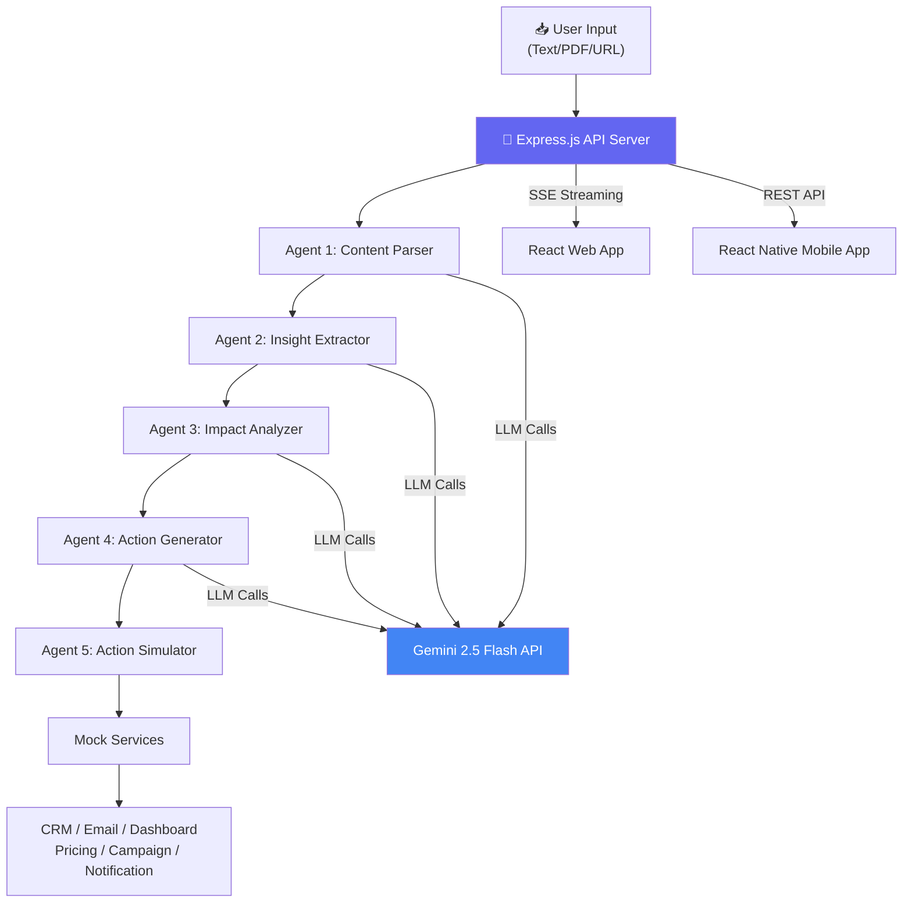

# ActionFlow AI — Autonomous Content-to-Action Agent

## Project Overview

Build an **Agentic AI System** that transforms unstructured content into actionable outcomes with a 5-stage pipeline: **Content Parsing → Insight Extraction → Impact Analysis → Action Generation → Action Simulation**.

You have an existing working prototype in `umar-Hackathon/`. We will migrate, enhance, and build it properly in `google-hackathon/`.

---

## Part 1: GCP Credit Utilization Guide

> [!IMPORTANT]
> Before writing code, let's set up GCP so your credits are properly utilized. These are the **initial steps** you need to do in the GCP Console.

### Step 1: Verify Your GCP Project & Billing

1. Go to [console.cloud.google.com](https://console.cloud.google.com)
2. Check the **project selector** (top bar) — you should see a project associated with your hackathon credits
3. Go to **Billing** → Verify your credits are applied (you should see a credit balance or a promotional billing account)
4. If no project exists, create one: **New Project** → name it `actionflow-ai`

### Step 2: Enable the Gemini API

You have **two options** for using Gemini with GCP credits:

#### Option A: Google AI Studio API Key (Simplest — Current Setup)
- Go to [aistudio.google.com](https://aistudio.google.com)
- Create an API key linked to your GCP project (so credits are billed to your GCP project)
- When creating the key, select your GCP project — this ensures API calls are billed against your credits
- This is what your `.env` already uses (`GEMINI_API_KEY`)

#### Option B: Vertex AI (More Enterprise — Better for Demos)
- Go to GCP Console → **APIs & Services** → **Enable APIs**
- Search and enable: **Vertex AI API**
- Also enable: **Generative Language API**
- This uses service account auth instead of API key
- Gives you access to the Vertex AI dashboard for monitoring usage

> [!TIP]
> **Recommendation:** Start with **Option A** (AI Studio key linked to your GCP project). It's simpler and your existing code already supports it. Just make sure the API key is tied to your GCP project for credit billing.

### Step 3: Other GCP Services to Leverage (Optional but Impressive)

| Service | Use Case | Credit Cost |
|---------|----------|-------------|
| **Cloud Run** | Deploy your server + web app | Very low (pay per request) |
| **Firebase Hosting** | Host the web frontend | Free tier usually sufficient |
| **Firebase Auth** | User authentication for mobile app | Free tier |
| **Cloud Storage** | Store uploaded PDFs | Minimal |
| **Cloud Logging** | Agent trace logs for demo | Free tier |

### Step 4: Enable Required APIs

Run these in GCP Cloud Shell or locally with `gcloud`:

```bash
# Set your project
gcloud config set project YOUR_PROJECT_ID

# Enable APIs
gcloud services enable aiplatform.googleapis.com
gcloud services enable run.googleapis.com
gcloud services enable cloudbuild.googleapis.com
gcloud services enable artifactregistry.googleapis.com
```

---

## Part 2: Project Build Plan

### Architecture



### Project Structure

```
google-hackathon/
├── server/                     # Express.js API
│   ├── agents/                 # 5 AI agents + orchestrator
│   │   ├── orchestrator.js     # Pipeline coordinator
│   │   ├── contentParser.js    # Agent 1: Parse unstructured input
│   │   ├── insightExtractor.js # Agent 2: Extract insights
│   │   ├── impactAnalyzer.js   # Agent 3: Analyze impact
│   │   ├── actionGenerator.js  # Agent 4: Generate actions
│   │   └── actionSimulator.js  # Agent 5: Simulate execution
│   ├── services/               # External service integrations
│   │   ├── gemini.js           # Gemini API wrapper
│   │   ├── mockCRM.js          # Mock CRM service
│   │   ├── mockEmail.js        # Mock email/SMS service
│   │   ├── mockDashboard.js    # Mock dashboard service
│   │   ├── mockNotification.js # Mock notification service
│   │   ├── mockPricing.js      # Mock pricing engine
│   │   └── mockCampaign.js     # Mock campaign manager
│   ├── utils/                  # Utilities
│   │   ├── pdfParser.js        # PDF text extraction
│   │   └── urlFetcher.js       # URL content fetcher
│   ├── data/
│   │   └── samples.js          # Sample scenarios
│   ├── index.js                # Express server entry
│   ├── package.json
│   └── .env
├── web/                        # React + Vite web app (optional deliverable)
│   ├── src/
│   │   ├── App.jsx             # Main app component
│   │   ├── index.css           # Global styles
│   │   ├── main.jsx            # Entry point
│   │   └── utils/
│   │       └── api.js          # API client
│   ├── index.html
│   ├── package.json
│   └── vite.config.js
├── mobile/                     # React Native / Expo mobile app (MUST)
│   └── (to be scaffolded)
├── package.json                # Root monorepo scripts
├── README.md                   # Documentation (deliverable)
└── Dockerfile                  # For Cloud Run deployment
```

---

## Proposed Changes

### Phase 1: Migrate Existing Code to `google-hackathon/`

Copy the full working codebase from `umar-Hackathon/` to `google-hackathon/` with the structure above (renaming `client/` → `web/`).

#### Files to create/copy:
- All server files (agents, services, utils, data)
- All web files (React app, CSS, API utils)
- Root package.json with updated scripts
- `.env` file

---

### Phase 2: Enhance Web App UI

The existing UI is solid but we can add polish:

#### [MODIFY] [App.jsx](file:///home/umar/umar-workspace/google-hackathon/web/src/App.jsx)
- Add a **Content Parsing results section** (currently skipped in the UI)
- Improve the **Before/After comparison** with animated number transitions
- Add export functionality for agent trace logs
- Add a "Powered by Google Antigravity" footer attribution

#### [MODIFY] [index.css](file:///home/umar/umar-workspace/google-hackathon/web/src/index.css)
- Add particle background animation for the hero area
- Enhance glassmorphism effects
- Add more micro-animations

---

### Phase 3: Mobile App (MUST Deliverable)

> [!IMPORTANT]
> The hackathon **requires** a mobile app. We'll use **React Native with Expo** for rapid cross-platform development.

#### [NEW] mobile/ directory
- Expo-based React Native app
- Screens: Input → Pipeline Progress → Results
- Connects to the same Express API backend
- Key features: Text input, camera-based document capture, results display

---

### Phase 4: Documentation & Deployment

#### [NEW] [README.md](file:///home/umar/umar-workspace/google-hackathon/README.md)
- Architecture overview with diagrams
- Setup instructions
- How Antigravity is used
- API documentation
- Screenshots

#### [NEW] [Dockerfile](file:///home/umar/umar-workspace/google-hackathon/Dockerfile)
- Multi-stage build for Cloud Run deployment
- Serves both API and static web assets

---

## Open Questions

> [!IMPORTANT]
> **Q1: GCP Project ID** — What is your GCP project ID? I need this to configure the deployment and API key setup correctly.

> [!IMPORTANT]
> **Q2: Mobile App Scope** — For the mobile app, would you like:
> - **(A)** A full React Native/Expo app (requires Expo Go on your phone for demo)
> - **(B)** A mobile-responsive web app (PWA) that works on phone browsers (faster to build, no app install)
> - Both options satisfy the "mobile app" requirement. Option B is much faster.

> [!IMPORTANT]
> **Q3: Domain Focus** — Your sample scenarios cover Business Operations and News/Policy. Should we keep these domains, or focus on a specific one for a more polished demo?

> [!IMPORTANT]
> **Q4: API Key** — Your existing `.env` has a Gemini API key. Is this key linked to your GCP project (so usage bills against your credits), or is it a standalone AI Studio key?

---

## Verification Plan

### Automated Tests
1. Start server and verify all endpoints respond:
   - `GET /api/health` → 200
   - `GET /api/samples` → returns sample data
   - `POST /api/analyze` → SSE stream with all 5 stages
2. Run a full analysis with a sample input and verify all pipeline stages complete
3. Build web app with `npm run build` → no errors

### Manual Verification
1. Open web app in browser → verify all UI sections render
2. Click a sample scenario → verify full pipeline executes
3. Check Before/After state shows changes
4. Check Agent Trace Log shows all reasoning steps
5. Test on mobile device (responsive or native app)

---

## Execution Order

1. ✅ GCP Setup (manual steps — user action required)
2. Migrate codebase to `google-hackathon/`
3. Enhance web UI
4. Build mobile app
5. Create README documentation
6. Test end-to-end
7. Deploy to Cloud Run (optional)
